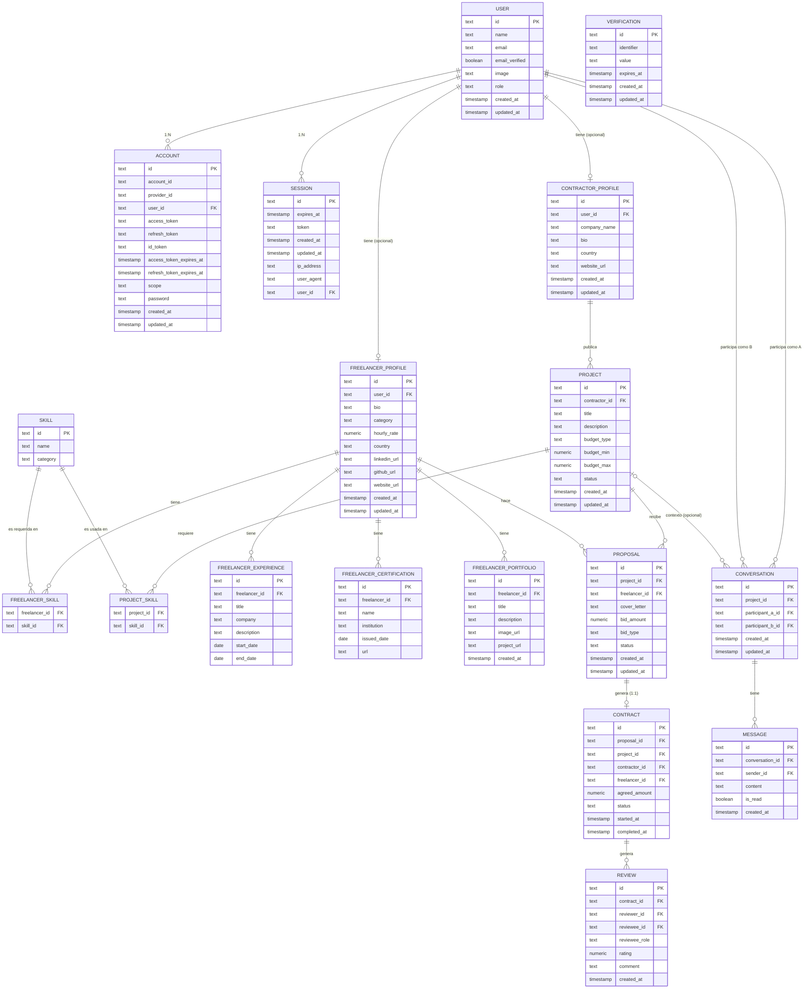

# Diagrama Entidad-Relación

> **Historial de cambios:**
>
> - `02/feb` — Tablas auth `[user, account, session, verification]` creadas por Better Auth
> - `24/feb` — Campo `role` añadido a tabla `user`
> - `02/mar` — Tablas de negocio añadidas
> - `03/mar` — Campo `reviewee_role` añadido a tabla `review`
> - `13/abr` — Tablas `freelancer_skill` y `project_skill` añadidas explícitamente al diagrama

---

[Click aquí para ver el ER Diagram ](https://mermaid.live/edit#pako:eNrVGe1O20jwVVaWKoEEiBQfgfxLXYemDXGUhN7phGRt7CXZYnt93nWAA6Q-RJ-wT3KzTuzYzpqYAro0AsmZ2Zmd7w_nXnOYS7SWRqKPFE8j7F8GlwGCz7t36OeP7__XXyZD-2L8Ce2cES4oC7DLUMgi9IEIQSLUjsVsdzukXUhxMTKH6H7xLD-C3ApEXTT4UoIF2CclEPEx9VawCWMewcECbM9JRK8occusfTwt84mALgeiPpgO-yFyIoIFcW0sVNg4dAvYx1SltmFYF_1xLa2w47A4EDYtyxlGbE5dEq1jYp5AUUfBi3BuC3ZNgrKG5CoifKbEUXcNnOmYZ2mT25AClwpzFK5Qn5W3cYeFZfuHmPMbFrmv6IORORp1rf5GH2ScKgWutM3zJFtJENrYdeEqrvIrBGcgNjg8U_KrOex2ukZ7XEfTBQy4y6yISog59mJS2ywvdc6W1MmBOex0e-Zom8phZ2iavXbfMIf2YGhJ8Wo5trImTCgrQRzwyZRFdytwEPtQKx00Y3Hk3dkRHCjTyBqVJ0mgHg2uiUsDG8hKqCkVs3iiQNyQCaeClDAvDSjD6o-HbWNsvZLVHOaHOLizFT1HYVClcd5G0dGXbq_3q-2y6PlHRcip2UNdJx4OnApj8Wvqecr6BL74bBrjCrbQ4b4RRzyTZ05a8y_I4K4Jz7UsskENQYVH1HFQgrqEOxEN5XS1wkiHIfBeJGy3kEAJggRuDqxSBv7HzyvmG_RRBAANYCQUsUJwynlM3JLkixxJ41cl9MAajjtWr2u9lQOUpl7NcYoCk0ZVzbzbtp7U6V18tiBxun2jO2j30EcT9c0zy-ha29Slloldy-sOg-qIHcFew-uT2J0SYYu7_AyZ9q8l0qdBNQ7fliuNwCLmr1iiwTYDa9SuV6WfqoEb0sVhsOHYXrLWKfSFqR77sjOt9S-3ZL63MUPakuuaIWQce0pFn7LRhuCqNmFqJ9jfCakwVbVNkjpfaRPZNcAvKqsMza9d889n5Y1SsYjMKbmpiIwlkjyNLC69qT1g-KPBdL0N-sW15Lepp8an9nibKiekBWxto_pd_qnoDyEKqUNhRBE23nhisnbipTl-Dkt2-8ysG85QrziWRV098sGMVFnqAlGIv_RND-U2SO7-joE5hBkKunp_u9ZP-fYwFrPcq7mHh_19dp-902qhS63R6l9q60fSVy65I6tVm0RX1CMc7TRaDcRCR76Z9NDP7z9QHCR7GAphACXg7wCesT9hfLd8xYNqO5a3CQpUaCdlu7su3YNqRawizaQeyS2Eo37rHO3MKUYCTzzMUUjnTOxW7utLc6ytVdl1qXgL8FPHwWAR-SeGyuxi2CFSwnT8WpIW1yxJJ4koidQ3rR-Ha2KOsytW-seTffnCyMUwkcFU5uUa6jPUz-1pazaoxaC4G_0aj9WqUqBfDd5e_I1BtaWBLJceaIsC2JaddN1XxE_RngnfMJ541MHVjlqMhgsfOXRSQ4cC0Qw7JMd8gShFeHJwKvMIJ-mWpUN2YMl5OYysjhcMYszS0plP8kL_SjROO4ycEhhqqyrDJqIPOQlXB5fEaZNZc3tmXKa-JOkat4IVslvb06aQTVpLRDHZ02Do8bH8qiU9DG6YEVibNUnvkisce0Je9whk0EP_ZsxPKSMWT2da6wp7HL4tWuTy56DsSNLRDDlZai39_WHCQ2vda7daa_-kedDUG4enR039-PSw-ceedgdQ_VA_aDbeH-mN06NTgOuPe9q_ya2NA715rOsnjePDhn5yfKIf7WnEpTD5ni9-jUp-lHr8D7KQsRo)

> Codigo del diagrama para mermaid

