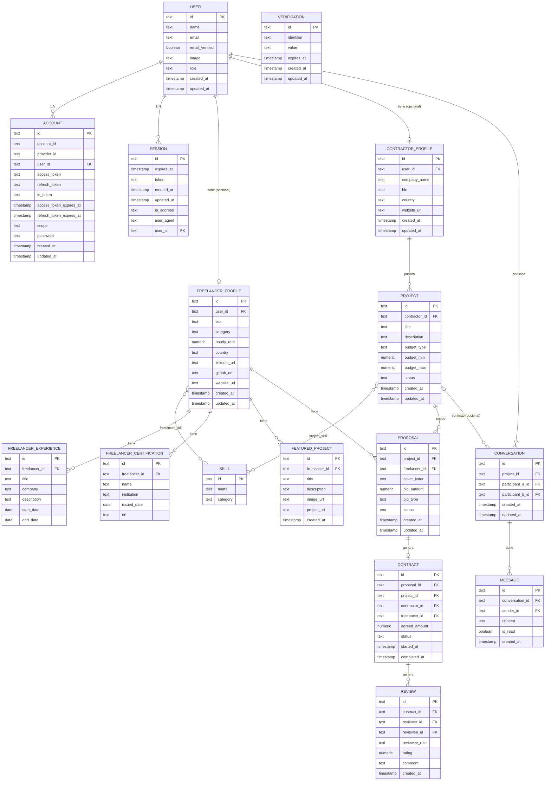

Diagrama entidad relación
2/feb — tablas auth [user, account, session, verification] creadas por Better Auth
24/feb — campo "role" añadido a tabla "user"
02/mar — tablas de negocio añadidas
03/mar — campo "reviewee_role" añadido a tabla "review"

[mermaidJS](https://mermaid.live/edit#pako:eNq1WP1O6zYUfxUr0pVAKqjlq9D_uhKm7kKL2nI3TUiRG5vWkMSR7ZR2gLSH2GvsKfYme5Idp02apA5NB1RCJD4-x-f8zqfzYrmcUKtlUXHJ8ERg_z64DxD87ob2AL0sn_VP0blCjKDb74W1APu0sER9zLz12phzj-JguezMqGAPjJKiaB9PinIE8GWWmE-lwn6IXEGxosTBykSNQpKjviUmtTud_l1vVMkq7Lo8CpTDinqGgs8YoWKTEsl4FV0ZZFEpHcWfaFC0kD4IKqdGGiMby6mNWZEOnYcMpJTAkTvCvFefJl0eFvEPsZTPXJBP9MHQHg67_d5WH6SSShUuxWY3zdYahA4mBI6SJr9CcAZqi8NTI3_Yg-5Vt9MeVbF0uQbSdVaIAmGGvYhWhuXDzvnevb7-v0nvgswJF4uCzKuBbV-3ex174NwO-lfda7vSAaXJNGb83YP1L4h8KDIumvJIeAtHwIYij07uLEu86rHgiRIWOMBWIE2YmkZjA-GZjiVTtED5qCc6_d5o0O6M-p-Emsv9EAcLx-A3A6BGcL7G0Ex42L_dQt7Y8FzJVqhq1MOBW2KxYsqjZhQKq4RKV7BQMZ4pJ1pdBLoL5ZBc-MQEGpDMsskY-BvtVgO22GPwHAskWBkZFGdSRpQUNF9GSOK9tdJ2e3Q3sC91oP1id0ZfBb4R5nXrN6QWtNpH6qqqEZdatIshLodQx67in2HIOCITqhy1yHbSpBitiD4Lyml4XuzKCqtIfmK-ATa3_WG7WpVPHGBCZksEuBzmPMejSmV7WmovzDbY12VmoxiRAnxfA0NSX6vCEHKJPaOh72G0JbjKIUxwgomc0hKoyjGJy1YpJroIgl9MqAzsH137153yxmiYoDNGn0siY0Wk7xPzo3-CB3RyFkw2q7qfH862lwjwPwxpw-rV-T03hwA3cxm0FuXgrTvGGzs-Gsw3MFO3f7ar-g0SU2JdvYyqSuhtpTkdqBzQycWOSQc0Jzt54Ns31I7UNHPZfH09OOAv6S2the6tRqt3b21uSS4RmS2p0FsqHphHJdprtBqIhy4Yij30759_oSiIByQUQm-kYFIAz9gfc7lfPOLVNLbq0xQDLrSXiN3f1O7VNLuVsaZaD5-Y50nUa92kS9dYIoXHHvwL2YznyoXU29EijcrlO50zCVbBdII8jC5_SkWFVHAUcPAt8iNwjACfQdZwpG8dBJMYnTceY6vPEzSEuwUQMfTm0Pvnb5eBM-Gdls70K-7lDUKbW9Q2QSppzhsMOVvy4ETjg5Wm4FdCvQwUpQqtQsU8X6b-SLSqJCA_0-0iozhi5XhTO6-86JGDT1mgS4UHlqIAbjZuMqAbAmt1QFZuGI095uIi3uudy_6vtwrqsnEF_XNMU-zSjPAloRD68caJTrBUj5S0krnqNfmNKRSdKVZoD0JO4kfwOQ1mDBMOmcBFnGs1JFmgg5MLaHZIRvpbEYJ-BJmyv1kwcuU-BikpyBn11jtWXEld3fB0iik3S48L5VzxXLZbNWsiGLFaSkS0ZkFD87F-teKyDSdMKUz4luYn9AFHntLHvQEbtI3fOfcTTsGjydRqPWBPwtuyK6w-3qVb4iLe0VOD1TqqN2MZVuvFmlut47PTw-Pm2VH99KJx3DivX9SshdU6aR6enh2d1uvN5vlJ_aJ5-laz_ogPrR-eN2G9Xm-cHB_Vj85PTmoWXJJhqLlZfjqMvyC-_QfcXDWS)

